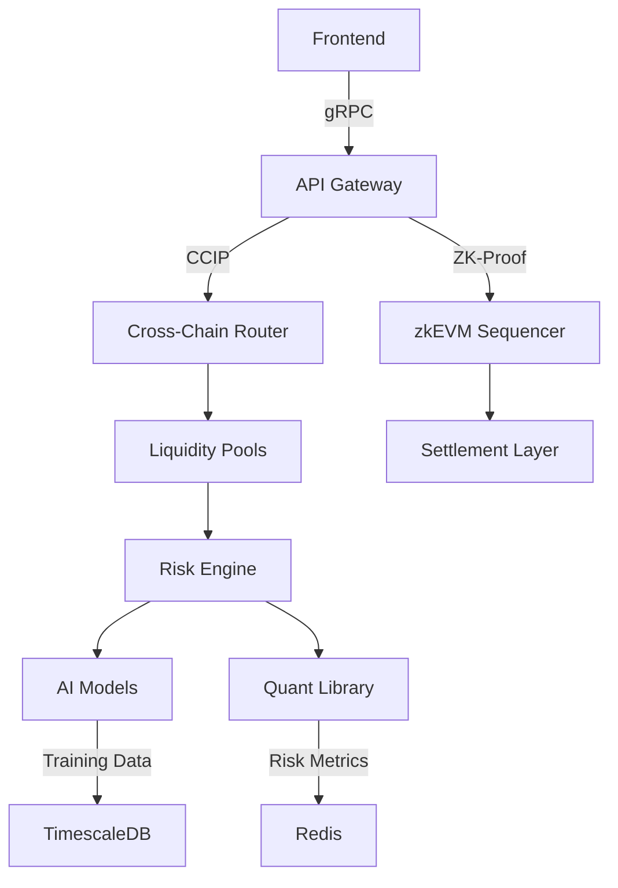

# Synthetic Asset Liquidity Engine (Fluxion)  
[](https://opensource.org/licenses/MIT)  

## 🌀 Overview  
Fluxion is a next-generation decentralized exchange engine for synthetic assets, combining ZK-Rollup scalability with AI-driven liquidity optimization. Facilitates institutional-grade trading with hybrid AMM models and cross-chain composability.  

## 🚀 Key Features  
- Hybrid AMM Design (Curve-style stable swaps + Uniswap V3 concentrated liquidity)  
- Zero-Knowledge settlement via Polygon zkEVM  
- Transformer-based liquidity demand forecasting  
- Chainlink CCIP-powered cross-chain arbitrage  
- Dynamic fee schedules adjusted via reinforcement learning  
- Institutional trading tools (TWAP/VWAP/Custom slippage)  
- GPU-accelerated risk calculations  
- Multi-sig governance with time-locked upgrades  
- Real-time liquidity monitoring dashboard  
- The Graph-powered historical analytics  

## 🛠️ Tech Stack  
**Blockchain**: Solidity 0.8, Chainlink CCIP, Foundry, Polygon zkEVM  
**Backend**: FastAPI, Celery, Redis, NumPy, SciPy  
**AI/ML**: PyTorch 2.0, Transformers, Prophet, Optuna  
**Frontend**: React 18, Recharts, ethers.js 6  
**Database**: TimescaleDB, Redis Stack  
**Infra**: Kubernetes, Prometheus, Grafana, ArgoCD  

## 🏗️ Architecture  



## ⚙️ Installation

```bash
# Clone repository  
git clone https://github.com/abrar2030/Fluxion.git  
cd Fluxion  

# Install dependencies  
cd blockchain && forge install  
cd ../backend && pip install -r requirements.txt  
cd ../frontend && npm install  

# Configure environment  
cp .env.example .env  
# Add blockchain RPC URLs and API keys  

# Start services  
docker-compose -f infra/docker-compose.zk.yml up -d  
cd backend && celery -A engine worker -l INFO --pool=gevent  
uvicorn api:app --host 0.0.0.0 --port 8000  
cd ../frontend && npm start  
```

## 🚢 Deployment

```bash
# 1. Train liquidity prediction model  
python ml_models/train_liquidity_model.py \
  --data ./historical_trades.csv \
  --epochs 100 \
  --gpus 4  

# 2. Deploy smart contracts  
forge create --rpc-url polygon-zkevm \
  --constructor-args $LINK_ADDRESS \
  --private-key $DEPLOYER_KEY \
  src/SyntheticAssetFactory.sol:SyntheticAssetFactory  

# 3. Deploy subgraph  
graph deploy --node https://api.thegraph.com/deploy/ \
  --ipfs https://api.thegraph.ipfs.io/ipfs \
  sal-e  

# 4. Apply infrastructure  
cd infra/terraform  
terraform init && terraform apply -auto-approve  

# 5. Monitor deployment  
kubectl apply -f k8s/synthetic-engine.yaml  
kubectl get pods -w  
```

## 📄 License  
Distributed under MIT License - See [LICENSE](./LICENSE)
