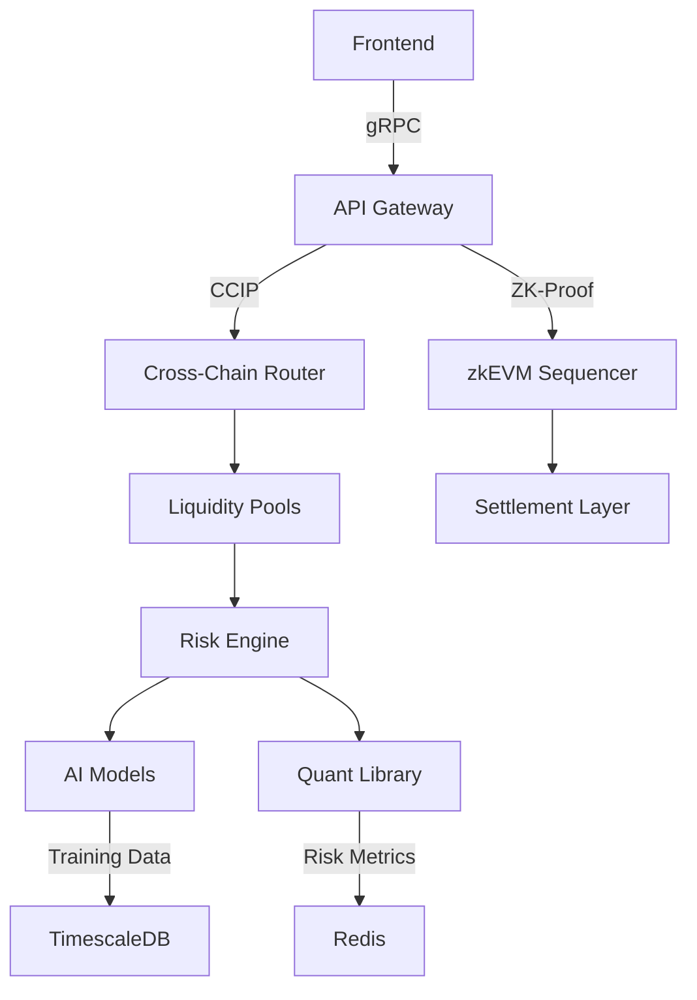

# Synthetic Asset Liquidity Engine (Fluxion)

[](https://github.com/abrar2030/Fluxion/actions)
[](https://github.com/abrar2030/Fluxion/actions)
[](https://codecov.io/gh/abrar2030/Fluxion)
[](https://opensource.org/licenses/MIT)

## Overview

Fluxion is a next-generation decentralized exchange engine for synthetic assets, combining ZK-Rollup scalability with AI-driven liquidity optimization. It facilitates institutional-grade trading with hybrid AMM models and cross-chain composability.

<div align="center">
  
</div>

> **Note**: This Project is currently under active development. Features and functionalities are being added and improved continuously to enhance user experience.

## Table of Contents
- [Key Features](#-key-features)
- [Feature Implementation Status](#feature-implementation-status)
- [Tech Stack](#-tech-stack)
- [Architecture](#-architecture)
- [Installation](#-installation)
- [Deployment](#-deployment)
- [Testing](#testing)
- [CI/CD Pipeline](#cicd-pipeline)
- [Contributing](#-contributing)
- [License](#-license)

## 🚀 Key Features
- Hybrid AMM Design (Curve-style stable swaps + Uniswap V3 concentrated liquidity)
- Zero-Knowledge settlement via Polygon zkEVM
- Transformer-based liquidity demand forecasting
- Chainlink CCIP-powered cross-chain arbitrage
- Dynamic fee schedules adjusted via reinforcement learning
- Institutional trading tools (TWAP/VWAP/Custom slippage)
- GPU-accelerated risk calculations
- Multi-sig governance with time-locked upgrades
- Real-time liquidity monitoring dashboard
- The Graph-powered historical analytics

## Feature Implementation Status

| Feature | Status | Description | Planned Release |
|---------|--------|-------------|----------------|
| **AMM Design** |
| Stable Swap Pools | ✅ Implemented | Curve-style efficient stablecoin swaps | v1.0 |
| Concentrated Liquidity | ✅ Implemented | Uniswap V3-style focused liquidity | v1.0 |
| Custom Bonding Curves | ✅ Implemented | Specialized asset-specific curves | v1.0 |
| Dynamic Fee Tiers | 🔄 In Progress | Adaptive fee calculation | v1.1 |
| Impermanent Loss Protection | 📅 Planned | Mitigate LP risk exposure | v1.2 |
| **Zero-Knowledge Technology** |
| Polygon zkEVM Settlement | ✅ Implemented | Scalable transaction processing | v1.0 |
| Private Transactions | ✅ Implemented | Confidential trading | v1.0 |
| Batched Settlements | ✅ Implemented | Efficient transaction grouping | v1.0 |
| ZK Proofs for Compliance | 🔄 In Progress | Regulatory verification without data exposure | v1.1 |
| Cross-chain ZK Bridges | 📅 Planned | Privacy-preserving chain interoperability | v1.2 |
| **AI and Forecasting** |
| Liquidity Demand Forecasting | ✅ Implemented | Predict trading volume needs | v1.0 |
| Transformer Models | ✅ Implemented | Advanced sequence modeling | v1.0 |
| Reinforcement Learning | ✅ Implemented | Dynamic parameter optimization | v1.0 |
| Anomaly Detection | 🔄 In Progress | Identify market irregularities | v1.1 |
| Federated Learning | 📅 Planned | Privacy-preserving collaborative models | v1.2 |
| **Cross-Chain Capabilities** |
| Chainlink CCIP Integration | ✅ Implemented | Cross-chain interoperability | v1.0 |
| Cross-chain Arbitrage | ✅ Implemented | Multi-chain price efficiency | v1.0 |
| Asset Bridging | ✅ Implemented | Transfer assets between chains | v1.0 |
| Unified Liquidity | 🔄 In Progress | Cross-chain liquidity aggregation | v1.1 |
| Chain-agnostic Interfaces | 📅 Planned | Seamless multi-chain experience | v1.2 |
| **Institutional Features** |
| TWAP/VWAP Execution | ✅ Implemented | Time/volume-weighted execution | v1.0 |
| Custom Slippage Controls | ✅ Implemented | Precise trade execution parameters | v1.0 |
| Risk Management Tools | ✅ Implemented | Portfolio exposure monitoring | v1.0 |
| OTC Trading Desk | 🔄 In Progress | Large block trade facilitation | v1.1 |
| Institutional API | 📅 Planned | Programmatic platform access | v1.2 |

**Legend:**
- ✅ Implemented: Feature is complete and available
- 🔄 In Progress: Feature is currently being developed
- 📅 Planned: Feature is planned for future release

## 🛠️ Tech Stack
**Blockchain**: Solidity 0.8, Chainlink CCIP, Foundry, Polygon zkEVM  
**Backend**: FastAPI, Celery, Redis, NumPy, SciPy  
**AI/ML**: PyTorch 2.0, Transformers, Prophet, Optuna  
**Frontend**: React 18, Recharts, ethers.js 6  
**Database**: TimescaleDB, Redis Stack  
**Infra**: Kubernetes, Prometheus, Grafana, ArgoCD  

## 🏗️ Architecture



## ⚙️ Installation

```bash
# Clone repository  
git clone https://github.com/abrar2030/Fluxion.git  
cd Fluxion  

# Install dependencies  
cd blockchain && forge install  
cd ../backend && pip install -r requirements.txt  
cd ../frontend && npm install  

# Configure environment  
cp .env.example .env  
# Add blockchain RPC URLs and API keys  

# Start services  
docker-compose -f infra/docker-compose.zk.yml up -d  
cd backend && celery -A engine worker -l INFO --pool=gevent  
uvicorn api:app --host 0.0.0.0 --port 8000  
cd ../frontend && npm start  
```

## 🚢 Deployment

```bash
# 1. Train liquidity prediction model  
python ml_models/train_liquidity_model.py \
  --data ./historical_trades.csv \
  --epochs 100 \
  --gpus 4  

# 2. Deploy smart contracts  
forge create --rpc-url polygon-zkevm \
  --constructor-args $LINK_ADDRESS \
  --private-key $DEPLOYER_KEY \
  src/SyntheticAssetFactory.sol:SyntheticAssetFactory  

# 3. Deploy subgraph  
graph deploy --node https://api.thegraph.com/deploy/ \
  --ipfs https://api.thegraph.ipfs.io/ipfs \
  sal-e  

# 4. Apply infrastructure  
cd infra/terraform  
terraform init && terraform apply -auto-approve  

# 5. Monitor deployment  
kubectl apply -f k8s/synthetic-engine.yaml  
kubectl get pods -w  
```

## Testing

The project includes comprehensive testing to ensure reliability and security:

### Smart Contract Testing
- Unit tests for contract functions using Foundry
- Integration tests for protocol interactions
- Fuzz testing for edge cases
- Formal verification for critical components

### AI Model Testing
- Model validation with cross-validation
- Backtesting against historical market data
- Performance metrics evaluation
- Adversarial testing for robustness

### Backend Testing
- Unit tests with pytest
- API integration tests
- Performance benchmarks
- Load testing with Locust

### Frontend Testing
- Component tests with React Testing Library
- End-to-end tests with Cypress
- Visual regression tests with Percy

To run tests:

```bash
# Smart contract tests
cd blockchain
forge test

# AI model tests
cd ml_models
pytest

# Backend tests
cd backend
pytest

# Frontend tests
cd frontend
npm test

# End-to-end tests
cd e2e
npm test
```

## CI/CD Pipeline

Fluxion uses GitHub Actions for continuous integration and deployment:

### Continuous Integration
- Automated testing on each pull request and push to main
- Code quality checks with ESLint, Prettier, and Pylint
- Test coverage reporting
- Security scanning for vulnerabilities
- Smart contract verification

### Continuous Deployment
- Automated deployment to staging environment on merge to main
- Manual promotion to production after approval
- Docker image building and publishing
- Kubernetes deployment via ArgoCD
- Infrastructure updates via Terraform

Current CI/CD Status:
- Build: 
- Test Coverage: 
- Smart Contract Audit: 

## 🤝 Contributing

We welcome contributions to improve Fluxion! Here's how you can contribute:

1. **Fork the repository**
   - Create your own copy of the project to work on

2. **Create a feature branch**
   - `git checkout -b feature/amazing-feature`
   - Use descriptive branch names that reflect the changes

3. **Make your changes**
   - Follow the coding standards and guidelines
   - Write clean, maintainable, and tested code
   - Update documentation as needed

4. **Commit your changes**
   - `git commit -m 'Add some amazing feature'`
   - Use clear and descriptive commit messages
   - Reference issue numbers when applicable

5. **Push to branch**
   - `git push origin feature/amazing-feature`

6. **Open Pull Request**
   - Provide a clear description of the changes
   - Link to any relevant issues
   - Respond to review comments and make necessary adjustments

### Development Guidelines

- Follow Solidity best practices for smart contracts
- Use ESLint and Prettier for JavaScript/React code
- Follow PEP 8 style guide for Python code
- Write unit tests for new features
- Update documentation for any changes
- Ensure all tests pass before submitting a pull request
- Keep pull requests focused on a single feature or fix

## 📄 License
Distributed under MIT License - See [LICENSE](./LICENSE) for details