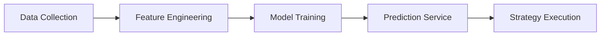
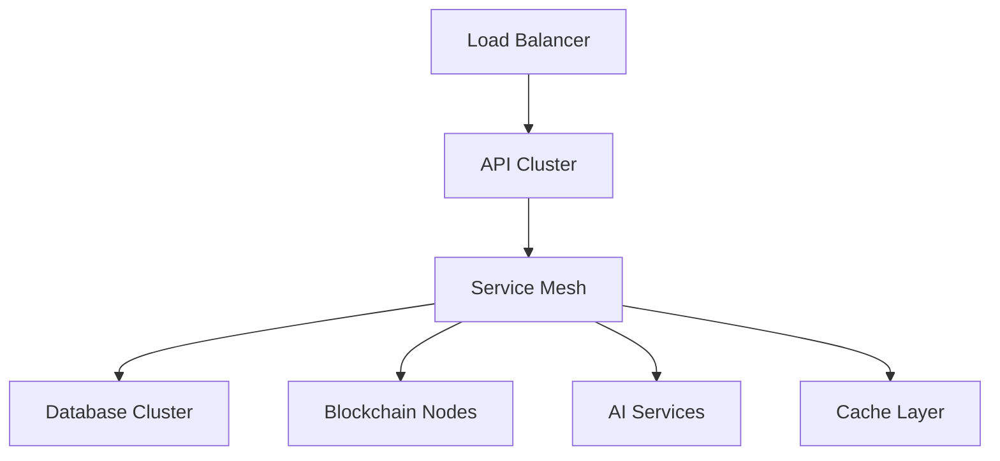

# System Architecture

## Overview

Fluxion is built on a microservices architecture leveraging ZK-Rollups for scalability and AI for liquidity optimization. The system is composed of several key components that work together to provide a robust synthetic asset trading platform.

## System Components

### 1. Frontend Layer

- **React Application**
    - Real-time trading interface
    - WebSocket-based market data streaming
    - Wallet integration via ethers.js
    - Interactive charting with Recharts
    - Responsive design for multiple devices

### 2. API Gateway

- **FastAPI Backend**
    - RESTful API endpoints
    - WebSocket server for real-time updates
    - Rate limiting and authentication
    - Request validation and sanitization
    - Load balancing and routing

### 3. Blockchain Layer

- **Smart Contracts (Polygon zkEVM)**
    - Synthetic asset minting and burning
    - Liquidity pool management
    - Order execution and settlement
    - Cross-chain message handling via CCIP
    - Governance and upgrade mechanisms

### 4. Liquidity Engine

- **Core Components**
    - Hybrid AMM implementation
    - Dynamic fee adjustment system
    - Liquidity provider incentives
    - Price impact calculations
    - Slippage protection

### 5. Risk Management System

- **Key Features**
    - Real-time risk monitoring
    - Value at Risk (VaR) calculations
    - Position limits enforcement
    - Collateral management
    - Liquidation triggers

### 6. AI/ML Pipeline

- **Components**
    - Market data aggregation
    - Feature extraction and preprocessing
    - Model training pipeline
    - Real-time inference service
    - Performance monitoring

### 7. Data Layer

- **Storage Solutions**
    - TimescaleDB for time-series data
    - Redis for caching and real-time data
    - The Graph for blockchain indexing
    - IPFS for decentralized storage

## Infrastructure

### Deployment Architecture

### Scaling Strategy

- Horizontal scaling of API nodes
- Read replicas for databases
- Distributed caching
- GPU cluster for AI workloads
- ZK-Rollup for blockchain scalability

### Monitoring & DevOps

- Prometheus metrics collection
- Grafana dashboards
- ELK stack for logging
- Automated CI/CD with GitHub Actions
- Infrastructure as Code with Terraform

## Security Measures

### Smart Contract Security

- Formal verification
- Multiple audit rounds
- Time-locked upgrades
- Emergency shutdown mechanism
- Bug bounty program

### Infrastructure Security

- Multi-factor authentication
- Network segmentation
- Regular security audits
- DDoS protection
- Key rotation policies

## Disaster Recovery

- Multi-region deployment
- Automated backups
- Failover procedures
- Data replication
- Business continuity planning

## Future Improvements

1. Layer 3 scaling solution integration
2. Advanced MEV protection
3. Cross-chain liquidity aggregation
4. Enhanced privacy features
5. Improved governance mechanisms
